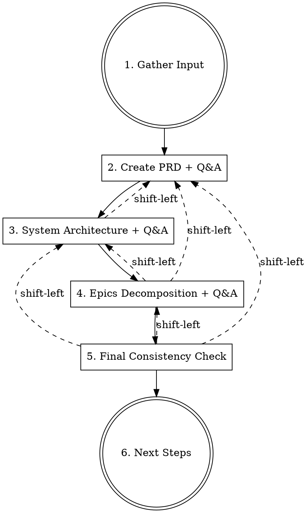

# Project Kickoff

End-to-end project definition: PRD → System Architecture → Epics. Each stage has a Q&A cycle with shift-left feedback — downstream stages propose updates to upstream documents when gaps are discovered.

## Files to Read Before Starting

Read the following files using the Read tool before starting:
- `.claude/skills/docs/requirements_analysis_format.md` — Reuse format patterns for PRD structure
- `.claude/skills/docs/question_format.md` — Question format for Q&A cycles
- `.claude/skills/docs/domain_knowledge_reference.md` — Domain knowledge progressive reference guide

**Parallel processing principle**: File reading and code investigation should be parallelized.

## Path Convention

All outputs go under `docs/` at the project root:
- PRD: `docs/product-requirements-document.md`
- Architecture: `docs/system-architecture.md`
- Epics: `docs/epics.md`
- Q&A files: `docs/kickoff_q_and_a.md`

## Core Flow

## Processing Steps

### 1. Gather Input

Use AskUserQuestion to have the user choose from:
1. **Specify a URL** (Notion doc, existing PRD, reference material, etc.)
2. **Direct input** (project idea, conversation summary, even a one-liner)
3. **Specify a Figma URL** (extract product vision from designs)

- For URLs: Fetch and read the content (Notion: MCP ToolSearch → notion-fetch, Web: WebFetch)
- For Figma: Load Figma tools via ToolSearch, then use get_design_context to fetch content
- For direct input: Ask the user to describe the project, even if fragmentary. Encourage them to share:
  - What problem they're solving
  - Who the users are
  - Any technical preferences or constraints

If the input is thin (< 3 sentences), ask 3-5 clarifying questions via AskUserQuestion before proceeding:
- Target users and their pain points
- Expected scale (users, data volume)
- Technical constraints or preferences
- Timeline or phasing expectations
- Integration requirements

### 2. Create PRD

#### 2.1 Generate PRD Draft

Create `docs/product-requirements-document.md` with these sections:

1. **Overview** — 2-3 sentence project summary
2. **Goals and Objectives** — Business and user value (table format)
3. **Tech Stack** — Component, technology, rationale (table format)
4. **System Architecture** — High-level ASCII diagram showing major components
5. **Project Phases** — Break requirements into delivery phases (MVP first)
   - Each phase contains:
     - Functional requirements (FR-NNN format, table with ID + details)
     - API endpoints (if applicable)
     - Deliverables checklist
6. **Non-Functional Requirements** — Performance, security, operational (NFR-NNN format)
7. **Configuration Reference** — Environment variables with defaults
8. **Success Criteria** — Measurable targets (table format)

**Principles:**
- Every requirement gets a unique ID (FR-001, NFR-001, SC-001)
- Use "MUST", "SHOULD", "MAY" for requirement levels
- Include rationale for tech stack choices
- Phase 1 should be a functional MVP — resist scope creep

#### 2.2 PRD Q&A Cycle

1. Identify unclear points, missing information, and ambiguities in the PRD
2. Create questions in `docs/kickoff_q_and_a.md` following `question_format.md`
   - Prefix with `# PRD Questions`
   - Include questions about:
     - Requirement priorities (what's truly MVP vs nice-to-have?)
     - Technical decisions with trade-offs
     - Missing non-functional requirements
     - Success criteria thresholds
3. Display file path and run `open {Q&A file path}` using the Bash tool
4. Display "Please let me know when you've answered"
5. Use AskUserQuestion with options: "Done", "I'd like investigation results output", "Other"
6. Update PRD based on answers
7. **Repeat until no questions remain**

### 3. Create System Architecture

#### 3.1 Generate Architecture Diagrams

Create `docs/system-architecture.md` with Mermaid diagrams. Auto-select applicable diagrams based on the PRD:

| Trigger | Diagram | Mermaid Type |
|---------|---------|-------------|
| Always | High-level system overview | `graph TB` with subgraphs per layer |
| Has data pipeline | Data/ingestion flow | `flowchart LR` |
| Has user-facing API | Query/request flow | `flowchart TB` |
| Has evaluation/CI | Quality gate flow | `flowchart LR` |
| Has Kubernetes/Docker | Infrastructure & deployment | `graph TB` with subgraphs |
| Has CI/CD | CI/CD pipeline | `flowchart LR` |
| Has multiple services | Component communication matrix | Markdown table |

**Include for every project:**
- High-level system overview (all layers)
- Data flow summary (text diagram at the end)

**Rules:**
- Maximum 8 diagrams — pick the most valuable for the team
- Each diagram gets a numbered heading and brief description
- Keep diagrams focused on the project scope, not generic patterns

#### 3.2 Shift-Left: Architecture → PRD

After generating architecture, check for PRD gaps:
- Does the architecture require components not mentioned in the PRD?
- Are there integration points the PRD doesn't address?
- Does the deployment model imply NFRs not captured?
- Are there services in the architecture without corresponding requirements?

**If gaps are found:**
1. List each gap with the specific PRD section that needs updating
2. Propose the exact text to add/modify
3. Use AskUserQuestion: "Architecture revealed these PRD gaps. Apply updates?"
   - "Yes, apply all" → Update PRD, note changes in Q&A file
   - "Let me review each" → Present one by one for approval
   - "Skip" → Note as unresolved items
4. After updates, re-check architecture for consistency

#### 3.3 Architecture Q&A Cycle

1. Append questions to `docs/kickoff_q_and_a.md` under `# Architecture Questions`
   - **IMPORTANT: Read the existing Q&A file first. APPEND questions, never overwrite.**
   - Question numbers continue sequentially from previous sections
2. Display file path and run `open {Q&A file path}` using the Bash tool
3. Q&A cycle same as Step 2.2 — repeat until resolved
4. Update architecture based on answers

### 4. Create Epics

#### 4.1 Decompose PRD into Epics

Create `docs/epics.md` with:

1. **Epic Overview Table** — Epic ID, phase, title, priority, status (table format)
2. **Per-Epic Sections** — For each epic:
   - Goal (1-2 sentences)
   - User story (As a..., I want..., so that...)
   - Requirements (table: ID + requirement, mapped from PRD FR-NNN IDs)
   - Data flow (ASCII or brief description)
   - Acceptance criteria (checklist)
   - Key files (planned source paths)
   - Dependencies (which epics must come first)

**Decomposition rules:**
- Each PRD phase maps to 2-4 epics
- Each epic should be deliverable independently (given dependencies are met)
- Epic IDs: E-001, E-002, etc.
- Every PRD functional requirement must map to exactly one epic
- Flag any orphaned requirements (in PRD but not in any epic)

#### 4.2 Shift-Left: Epics → PRD + Architecture

After decomposing epics, check for upstream gaps:

**PRD gaps:**
- Are there requirements that are too vague to assign to a single epic?
- Did decomposition reveal missing requirements (e.g., shared infrastructure, configuration)?
- Are there implicit dependencies the PRD doesn't capture?

**Architecture gaps:**
- Does the epic structure imply components not in the architecture?
- Are there new data flows or integration points?

**If gaps are found:**
1. List each gap with the upstream document and section affected
2. Propose specific updates
3. Use AskUserQuestion: "Epic decomposition revealed these gaps. Apply updates?"
   - "Yes, apply all" → Update PRD and/or architecture, note in Q&A
   - "Let me review each" → Present one by one
   - "Skip" → Note as unresolved
4. If PRD was updated, verify epics still align (re-check requirement mapping)

#### 4.3 Epics Q&A Cycle

1. Append questions to `docs/kickoff_q_and_a.md` under `# Epic Questions`
   - **IMPORTANT: Read existing Q&A file first. APPEND, never overwrite.**
   - Continue sequential question numbering
2. Display file path and run `open {Q&A file path}` using the Bash tool
3. Q&A cycle — repeat until resolved
4. Update epics based on answers

### 5. Final Consistency Check

Run a cross-document consistency check:

| Check | What to Verify |
|-------|---------------|
| Requirement coverage | Every FR-NNN in PRD maps to exactly one epic |
| Architecture alignment | Every component in architecture has corresponding requirements |
| Epic dependencies | No circular dependencies; dependency order is achievable |
| Tech stack consistency | Technologies in PRD match architecture diagrams |
| NFR coverage | Performance/security requirements apply to the right epics |
| Terminology | Same terms used consistently across all 3 documents |

**If inconsistencies are found:**
1. Present findings in a summary table (document, issue, proposed fix)
2. Use AskUserQuestion: "Apply consistency fixes?"
   - "Yes, apply all" → Fix all 3 documents
   - "Let me review each" → Present one by one
   - "Skip" → Note as known issues

### 6. Next Steps

Display summary:
- "Project kickoff complete. Created:"
- `docs/product-requirements-document.md` — {N} requirements across {M} phases
- `docs/system-architecture.md` — {N} diagrams
- `docs/epics.md` — {N} epics
- `docs/kickoff_q_and_a.md` — {N} questions resolved

Use AskUserQuestion to select next action:
1. **Create EPIC directory structure** (recommended) → Execute `/001-create-epic` via Skill tool for the first epic
2. **Run AI review of PRD** → Re-read PRD with fresh eyes and review for completeness
3. **Commit and push** → Commit all generated docs
4. **Finish**

## Common Mistakes

| Mistake | Fix |
|---------|-----|
| Generating all 3 docs without Q&A between them | Each stage MUST have its own Q&A cycle before proceeding |
| Overwriting Q&A file when appending new sections | Always read first, append with Edit tool |
| Skipping shift-left because "it's fine" | Always check — 30 seconds of verification prevents hours of rework |
| Making PRD too detailed for MVP | Phase 1 = minimum viable. Push features to later phases |
| Architecture diagrams showing generic patterns | Diagrams must be specific to THIS project's components |
| Epics without requirement traceability | Every epic must reference specific FR-NNN IDs from the PRD |